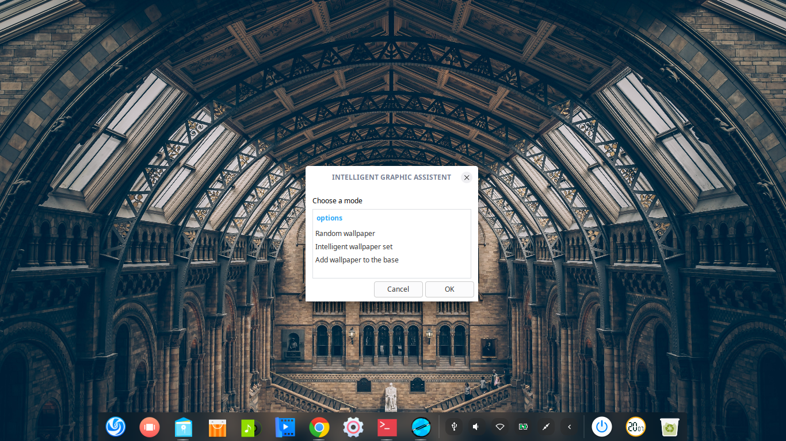
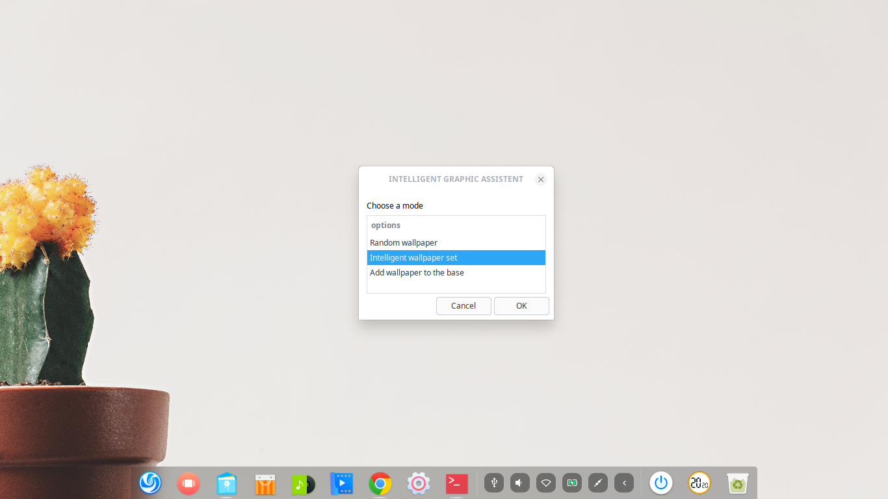
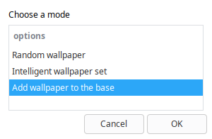
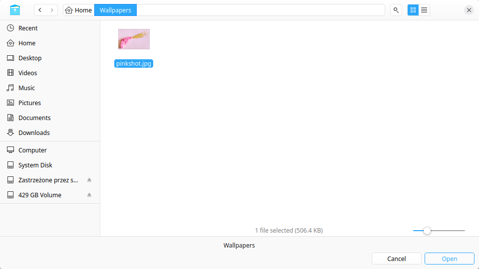
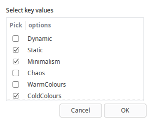

# IGA - Intelligent Graphic Assistent
## Sections

 - [Visuals](#visuals)
   	 - [Random wallpaper](#random-wallpaper )
	 - [Intelligent mode](#intelligent-mode)
	 - [Base mode](#Base-mode)
 - [Description](#description)
	 - [General](#general)
	 - [Features](#features)
	 - [How it works](#how-it-works)
	 - [Programming languages](#programming-languages)
	 - [Systems](#systems)
	 - [Files](#files)
	 - [Manpage](#manpage)
 - [Usage](#usage)
 - [Additional](#additional)
 
## Visuals

### Random wallpaper 

### Intelligent mode

Short questions like:

### Base mode

## Description

### General

**IGA** is Your best friends when it comes to **fast** wallpaper changes. It was written to **save You a trouble** of spending too much time on finding a new wallpaper.

### Features

 1. **Random wallpaper** - sets a random wallpaper from the **IGA's** base 
 2. **Intelligent wallpaper selection** - sets the most suitable wallpaper based on user's answers to a few questions
 3.  **Add wallpaper to the base** - adds a picture with selected key values describing the image to the **IGA's** base to expand its functionality

### How it works
Wallpapers stored in **IGA's** base are connected with specified key values, which describe the picture (like forest.png and Nature), that are located in the file. Answers to the questions are also connected with the key values and basing on them **IGA** chooses the wallpaper with the most biggest number of corresponding key values. 

 
### Programming languages

 - BASH
 
### Systems

 - Linux (Gnome right now)
 
### Files
Files that are required for **IGA** to work well are:
 - file with key list (for example **keys.txt** specified in IGA.sh)
- file with relation between wallpapers and keys and directory with wallpapers can be created by **IGA**
**header** contains short description and license
**IGAman** - manpage for IGA

### Manpage 

There is a manpage made for IGA - **IGAman** with listed options.

## Usage

 - everyday use for a Linux user that wants to change the wallpaper fast and satisfactory

## Additional

 - The more photos in IGA's base, the better it works to find the best wallpaper. You can find free photos there:
    - https://pixabay.com/
	- https://unsplash.com/
	- https://www.pexels.com/royalty-free-images/

 
